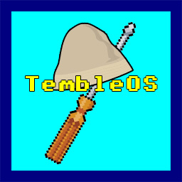

# Forkless TembleOS Virtual Machine



## Background

iOS does not allow `fork(2)` semantics.

Applications and daemons cannot create processes themselves and may not use the `system(3)` function. Instead, only `launchd` (equivalent to Linux' `init`) may create processes using `posix_spawn(3)`.

But what if we wanted to do it anyway? Maybe even run an `sshd` server with an interactive shell?

What started as a small project to statically compile [dropbear](https://github.com/mkj/dropbear) SSH and [mksh](https://github.com/MirBSD/mksh), glue them together and refactor the `fork(2)`s to `pthread_create(3)`s, ended up writing an entire POSIX abstraction!

## Build and run

**macOS:** You need gnu-sed (to build toybox), just run `$ brew install gnu-sed`.

To build, just run `$ make`.

To run, `$ ./forkless sshd` and an SSH server at port 2222 will start running with user:password `user:alpine`.

#### Tests

- **tvm tests**: for testing the vm specifically, build and run with `$ make test && ./test_tvm`.
- **forkless tests**: for testing `dropbear`+`mksh`+`toybox` over the tvm with **pytest**. You need to `$ pip install pytest pexpect` and then run `$ make && pytest test_forkless.py`.

## Current Features

### Programs

- `ssh` - dropbear
- `scp` - dropbear
- `sh` - MirBSD Korn Shell
  - builtins (`echo`, `export`, `cd`, etc..)
- `toybox` - `ls`, `cat`, `id`, `grep` etc
- `tvm` - tvm diagnostics
  - `tvm ps` - internal process list
  - `tvm lsof` - internal file-descriptor tables

### Platforms

- Linux x86-64
- XNU arm64

### TVM

- `fork()` creates a new task.
- Each task has its own file-descriptor table (with `0`, `1`, `2` pointing to task-specific files under the hood)
- All I/O operations (`read(2)` / `fwrite(3)` / `perror(3)` / `printf` / `getc`) operate on the task-specific file-descriptors / streams.
- Calls to `sigaction(2)` change the signal disposition only for the calling task.
- Full `kill(2)` / `waitpid(2)` support.
- Copy-on-write for each task.
- `execve(2)` and `exec(3)` with pre-registered programs.
- Userspace device drivers framework
  - TTY device (no real pty/tty is opened in host OS).
- Task-specific environment.
- Task-specific `getopt(3)` support.

Soon:
- `pthread_create(3)` with shared globals and private TLS (coming soon).

## Adding custom programs

As you can see in `main.c`, adding a new program is easy:

```c
int main(int argc, char **argv)
{
    tvm_init("forkless");
    tvm_register_program("/bin/sh", (main_func_t) mksh_main);
    tvm_register_program("/usr/bin/scp", (main_func_t) scp_main);

    // ...
}
```

Notice `mksh_main` and `scp_main` are the main functions of each program.

## Overview

TembleOS is a fully-fledged OS-layer abstraction that creates a `fork(2)`/`exec(2)`-enabled environment without ever using these functions, with the most minimal source code modifications.

The entire code is implemented in `tvm.c` (with a small API in `tvm.h`), and must be statically compiled with the rest of the program (dropbear and mksh in our case).

One basic concept is the "task". A task is essentially a tvm-process. It is a group of threads that together act like a POSIX-compliant process with `getpid(2)`, `getppid(2)` and other process-wide attributes being the same.

## Tests

Custom testing framework was developed, compiled with `$ make test`.

It has a similar API to pytest:

```
$ ./test_forkless -h
USAGE: ./test_forkless [OPTION]...
Run tests

  -l             print test list and exit
  -k=TEST        only run TEST (can be passed multiple times)
  -v             verbose output
  -g             debug with gdb
  -h             display this help and exit
```

## Etymology

TembleOS is a play on a few things. First and foremost a tribute to Terry A. Davis, the developer of [TempleOS](https://simple.wikipedia.org/wiki/TempleOS). Temble is hebrew for "dummy", which also is a name of an Israeli [hat](https://en.wikipedia.org/wiki/Tembel_hat) popular in mid-20th century.
